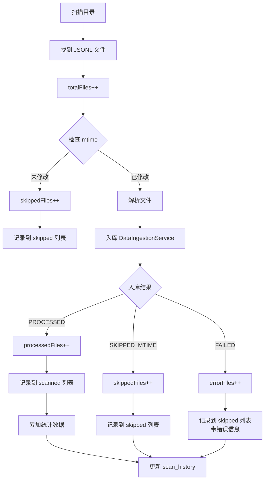

# 扫描文件记录与统计逻辑优化设计

**日期**: 2026-04-28  
**作者**: AI Assistant  
**状态**: 待实施

---

## 1. 问题背景

### 1.1 当前问题

#### 问题 1：`java-scanned-files-scan-X.txt` 记录不准确

**现状**：
- 该文件记录了所有**找到**的 JSONL 文件路径
- 包括因 mtime 未变化而跳过的文件
- 导致"scanned files"与实际处理的文件不一致

**影响**：
- 无法准确了解本次扫描实际处理了哪些文件
- 与 Python 脚本对比时产生误导
- 调试和审计困难

#### 问题 2：`dashboard_scan_history` 统计逻辑错误

**现状**：
1. `users_scanned` 和 `dirs_scanned` 都是 `users.size()`，没有区分实际扫描的用户数
2. 统计等式不成立：`files_processed + files_skipped + files_error ≠ files_total`
   - `files_total`：所有找到的文件数
   - `files_processed`：实际入库的文件数
   - `files_skipped`：仅包含处理错误的文件（第 433-434 行）
   - **缺失**：因 mtime 未变化而跳过的文件计数
3. `new_messages`, `new_turns`, `new_issues`, `new_skill_calls` 可能包含重复累计

**期望行为**：
- `files_processed + files_skipped + files_error = files_total`
- `files_skipped` 应包含两类：
  - mtime 未变化的文件
  - 其他跳过情况（如空文件）
- `files_error` 仅包含处理失败的文件
- `new_*` 字段反映本次扫描的实际处理量

---

## 2. 设计目标

### 2.1 核心目标

1. **文件记录准确性**：`java-scanned-files-scan-X.txt` 只包含实际处理（读取并入库）的文件
2. **统计逻辑正确性**：确保 `processed + skipped + error = total`
3. **性能优化**：避免解析未修改的文件，减少不必要的 I/O 和 CPU 开销
4. **可维护性**：职责清晰，易于扩展新的跳过逻辑

### 2.2 非目标

- 不改变现有的数据入库逻辑
- 不修改数据库 schema
- 不影响聚合统计功能

---

## 3. 设计方案

### 3.1 方案概述：混合方案（前置过滤 + 状态返回）

结合两种策略的优点：

1. **在 ScanOrchestrator 层提前检查 mtime**（避免解析开销）
2. **DataIngestionService 返回处理结果**（用于统计和错误分类）
3. **统一的状态管理**（确保统计一致性）

### 3.2 架构设计

```
ScanOrchestrator (文件发现与初步过滤)
  ├─ 扫描目录 → totalFiles++
  ├─ 检查 mtime (前置过滤)
  │   ├─ 未修改 → skippedFiles++, 记录到 skipped 列表
  │   └─ 已修改 ↓
  ├─ 解析文件 (TranscriptParser)
  ├─ 入库 (DataIngestionService)
  │   ├─ 成功 → processedFiles++, 记录到 scanned 列表
  │   └─ 失败 → errorFiles++, 记录到 skipped 列表（带错误信息）
  └─ 更新 scan_history
      ├─ files_total = 所有找到的文件
      ├─ files_processed = 实际入库的文件
      ├─ files_skipped = mtime未修改 + 其他跳过
      ├─ files_error = 处理失败的文件
      └─ 验证: processed + skipped + error = total
```

---

## 4. 详细设计

### 4.1 新增数据结构

#### 4.1.1 IngestionResult 记录类

**位置**: `com.company.clawboard.service.DataIngestionService`

```java
/**
 * 数据入库结果
 */
public record IngestionResult(
    IngestionStatus status,      // 处理状态
    int messageCount,            // 消息数量
    int turnCount,               // 对话轮次数量
    int issueCount,              // 问题数量
    int skillCount,              // Skill 调用数量
    String errorMessage          // 错误信息（如果有）
) {}

/**
 * 入库状态枚举
 */
public enum IngestionStatus {
    PROCESSED,           // 成功处理（读取并入库）
    SKIPPED_MTIME,       // 因 mtime 未变化而跳过
    SKIPPED_EMPTY,       // 文件为空或无有效数据
    FAILED               // 处理失败
}
```

**设计理由**：
- 使用 `record` 保证不可变性
- 包含完整的统计信息，避免多次查询
- 状态枚举清晰表达不同的处理结果

---

### 4.2 修改 DataIngestionService

#### 4.2.1 修改方法签名

**当前签名**：
```java
@Transactional
public void ingestParsedTranscript(Long scanId, String employeeId, ParsedTranscript parsed)
```

**新签名**：
```java
@Transactional
public IngestionResult ingestParsedTranscript(Long scanId, String employeeId, ParsedTranscript parsed)
```

#### 4.2.2 修改实现逻辑

**关键改动点**：

1. **保留 mtime 检查逻辑**（作为兜底）
2. **返回详细的处理结果**
3. **异常时返回 FAILED 状态**

```java
@Transactional
public IngestionResult ingestParsedTranscript(Long scanId, String employeeId, ParsedTranscript parsed) {
    if (parsed == null || parsed.sessionId() == null) {
        log.warn("Cannot ingest null or invalid parsed transcript");
        return new IngestionResult(IngestionStatus.SKIPPED_EMPTY, 0, 0, 0, 0, "Invalid parsed transcript");
    }

    String sessionId = parsed.sessionId();
    LocalDateTime now = LocalDateTime.now(BEIJING_ZONE);
    
    // ✅ 检查文件是否有变化（基于文件修改时间）- 作为兜底检查
    if (parsed.filePath() != null) {
        try {
            Path filePath = Path.of(parsed.filePath());
            if (Files.exists(filePath)) {
                long fileMtime = Files.getLastModifiedTime(filePath).toMillis();
                
                // 查询上次扫描的文件修改时间
                var progress = scanProgressMapper.selectByEmployeeAndFile(employeeId, parsed.filePath());
                
                if (progress != null && fileMtime <= progress.getFileMtime()) {
                    log.debug("File not modified (mtime: {}), skipping session {}", fileMtime, sessionId);
                    return new IngestionResult(IngestionStatus.SKIPPED_MTIME, 0, 0, 0, 0, null);
                }
                
                log.info("File modified (old mtime: {}, new mtime: {}), reprocessing session {}", 
                    progress != null ? progress.getFileMtime() : 0, fileMtime, sessionId);
            }
        } catch (Exception e) {
            log.warn("Failed to check file modification time for {}, proceeding with scan", parsed.filePath(), e);
        }
    }
    
    // Check if session already scanned (fallback check)
    int existingCount = messageMapper.countBySessionId(sessionId);
    if (existingCount > 0) {
        log.info("Session {} already scanned ({} messages), deleting old data and reprocessing", 
            sessionId, existingCount);
        // ✅ 删除旧数据，然后重新处理
        deleteExistingSessionData(sessionId);
    }

    try {
        // Phase 1: Insert conversation turns first
        List<DashboardConversationTurn> turns = convertToTurns(scanId, parsed.turns(), sessionId, employeeId, now, parsed.filePath());
        if (!turns.isEmpty()) {
            int inserted = turnMapper.batchInsertIgnore(turns);
            log.debug("Inserted {} turns for session {}", inserted, sessionId);
        }

        // Phase 2: Insert messages
        List<DashboardMessage> messages = new ArrayList<>();
        for (var msg : parsed.messages()) {
            DashboardMessage entity = convertSingleMessage(scanId, msg, sessionId, employeeId, now);
            messages.add(entity);
        }
        if (!messages.isEmpty()) {
            int inserted = messageMapper.batchInsertIgnore(messages);
            log.debug("Inserted {} messages for session {}", inserted, sessionId);
        }

        // Phase 3: Insert skill invocations
        List<DashboardSkillInvocation> skills = convertToSkillInvocations(
            scanId, parsed.skillInvocations(), sessionId, employeeId, now);
        if (!skills.isEmpty()) {
            int inserted = skillMapper.batchInsertIgnore(skills);
            log.debug("Inserted {} skill invocations for session {}", inserted, sessionId);
        }

        // Phase 4: Insert issues
        List<DashboardTranscriptIssue> issues = new ArrayList<>();
        for (var issue : parsed.issues()) {
            DashboardTranscriptIssue entity = convertSingleIssue(scanId, issue, sessionId, employeeId, now);
            issues.add(entity);
        }
        if (!issues.isEmpty()) {
            int inserted = issueMapper.batchInsertIgnore(issues);
            log.debug("Inserted {} issues for session {}", inserted, sessionId);
        }

        // Phase 5: Update session summary
        updateSessionSummary(scanId, sessionId, employeeId,
            parsed.messages(), parsed.turns(), now);

        // Phase 6: Update scan progress
        updateScanProgress(employeeId, parsed.filePath(), parsed.sessionId(), parsed.messages());

        // ✅ 收集本次扫描的小时信息（用于增量聚合）
        collectHoursFromMessages(parsed.messages());

        // ✅ 返回成功结果
        return new IngestionResult(
            IngestionStatus.PROCESSED,
            parsed.messages().size(),
            parsed.turns().size(),
            parsed.issues().size(),
            parsed.skillInvocations().size(),
            null
        );

    } catch (Exception e) {
        log.error("Failed to ingest transcript for session {}", sessionId, e);
        return new IngestionResult(
            IngestionStatus.FAILED,
            0, 0, 0, 0,
            e.getMessage()
        );
    }
}
```

---

### 4.3 修改 ScanOrchestrator

#### 4.3.1 在解析前检查 mtime（前置过滤）

**位置**: `scanUserDirectory` 方法，文件处理循环中

**当前代码**（第 358-375 行）：
```java
for (Path jsonlFile : jsonlFiles) {
    try {
        log.debug("Processing file: {} (employee: {})", jsonlFile.getFileName(), resolvedEmployeeId);
        
        // Parse transcript file
        var parsed = transcriptParser.parseFile(jsonlFile, employeeId);
        
        // Batch insert into database
        dataIngestionService.ingestParsedTranscript(scanId, resolvedEmployeeId, parsed);
        ...
    }
}
```

**新代码**：
```java
for (Path jsonlFile : jsonlFiles) {
    try {
        // ✅ 前置检查：文件 mtime
        boolean shouldSkip = false;
        String skipReason = null;
        
        try {
            long fileMtime = Files.getLastModifiedTime(jsonlFile).toMillis();
            var progress = scanProgressMapper.selectByEmployeeAndFile(resolvedEmployeeId, jsonlFile.toString());
            
            if (progress != null && fileMtime <= progress.getFileMtime()) {
                shouldSkip = true;
                skipReason = "File not modified (mtime: " + fileMtime + ")";
                log.debug("Skipping unmodified file: {}", jsonlFile.getFileName());
            }
        } catch (Exception e) {
            log.warn("Failed to check file mtime for {}, proceeding with parse", jsonlFile.getFileName(), e);
        }
        
        if (shouldSkip) {
            // ✅ 计入 skipped，不解析文件
            skippedFiles.put(jsonlFile.toString(), skipReason);
            skippedFilesCount++;
            continue;
        }
        
        log.debug("Processing file: {} (employee: {})", jsonlFile.getFileName(), resolvedEmployeeId);
        
        // Parse transcript file
        var parsed = transcriptParser.parseFile(jsonlFile, resolvedEmployeeId);
        
        // ✅ 入库并获取结果
        var result = dataIngestionService.ingestParsedTranscript(scanId, resolvedEmployeeId, parsed);
        
        if (result.status() == IngestionStatus.PROCESSED) {
            // ✅ 只有实际处理的文件才记录到 scannedFilePaths
            String relativePath = basePathObj.relativize(jsonlFile).toString();
            scannedFilePaths.add(relativePath);
            
            // 累加统计数据
            totalMessages += result.messageCount();
            totalTurns += result.turnCount();
            totalIssues += result.issueCount();
            totalSkills += result.skillCount();
            processedFiles++;
            
            log.debug("Parsed file: {} messages, {} turns, {} issues, {} skills",
                result.messageCount(), result.turnCount(), result.issueCount(), result.skillCount());
            
        } else if (result.status() == IngestionStatus.SKIPPED_MTIME) {
            // ✅ mtime 未变化（兜底检查触发）
            skippedFiles.put(jsonlFile.toString(), "File not modified (checked in ingestion service)");
            skippedFilesCount++;
            
        } else if (result.status() == IngestionStatus.FAILED) {
            // ✅ 处理失败
            String errorMsg = "Ingestion failed: " + result.errorMessage();
            skippedFiles.put(jsonlFile.toString(), errorMsg);
            errorFiles++;
            log.error("{}", errorMsg);
        }
        
    } catch (Exception e) {
        String errorMsg = "Failed to process file: " + e.getMessage();
        log.error("{}", errorMsg, e);
        skippedFiles.put(jsonlFile.toString(), errorMsg);
        errorFiles++;
    }
}
```

**关键改进**：
1. **前置过滤**：在解析前检查 mtime，避免不必要的解析开销
2. **精确统计**：根据 `IngestionResult` 的状态分类统计
3. **文件记录**：只在 `PROCESSED` 状态下添加到 `scannedFilePaths`

---

#### 4.3.2 修正 usersScanned 计算逻辑

**当前代码**（第 192 行）：
```java
history.setDirsScanned(users.size());
```

**问题**：`users.size()` 是扫描到的用户总数，包括没有任何文件的用户

**新代码**：
```java
// ✅ 计算实际扫描的用户数（有 processed 或 skipped 文件的用户）
int actualUsersScanned = 0;
for (var entry : futures.entrySet()) {
    try {
        UserScanResult result = entry.getValue().get(30, TimeUnit.MINUTES);
        if (result.filesProcessed() > 0 || result.filesSkipped() > 0 || result.filesError() > 0) {
            actualUsersScanned++;
        }
    } catch (Exception e) {
        log.error("Failed to get result for user {}", entry.getKey(), e);
    }
}

history.setUsersScanned(actualUsersScanned);
history.setDirsScanned(actualUsersScanned);  // 每个用户对应一个目录
```

**设计理由**：
- 只统计实际有文件处理的用户
- 更准确地反映扫描工作量

---

#### 4.3.3 验证统计等式

**在 finishScan 之前添加验证**：

```java
// ✅ 验证统计等式
int calculatedTotal = processedFiles + skippedFilesCount + errorFiles;
if (calculatedTotal != totalFiles) {
    log.warn("Statistics mismatch: processed({}) + skipped({}) + error({}) = {} != total({})",
        processedFiles, skippedFilesCount, errorFiles, calculatedTotal, totalFiles);
    // 不抛出异常，但记录警告以便调试
}

// Update scan history with results
history.setDirsScanned(actualUsersScanned);
history.setFilesTotal(totalFiles);
history.setFilesProcessed(processedFiles);
history.setFilesSkipped(skippedFilesCount);
history.setFilesError(errorFiles);
history.setNewMessages(totalMessages);
history.setNewTurns(totalTurns);
history.setNewIssues(totalIssues);
history.setNewSkillCalls(totalSkills);
```

---

### 4.4 文件列表生成逻辑

#### 4.4.1 java-scanned-files-scan-X.txt

**当前行为**：记录所有找到的文件（第 346-355 行）

**新行为**：只记录实际处理的文件

**实现**：已在 4.3.1 中实现，通过条件判断：
```java
if (result.status() == IngestionStatus.PROCESSED) {
    scannedFilePaths.add(relativePath);  // ← 只在处理成功时添加
}
```

#### 4.4.2 java-skipped-files-scan-X.txt

**当前行为**：仅记录处理错误的文件

**新行为**：记录所有跳过的文件（包括 mtime 未变化和错误）

**实现**：已在 4.3.1 中实现，所有跳过情况都添加到 `skippedFiles` Map：
```java
skippedFiles.put(jsonlFile.toString(), skipReason);
```

---

## 5. 数据流图

### 5.1 文件处理流程



### 5.2 统计等式验证

```
files_total = 所有找到的文件数
files_processed = 实际入库的文件数
files_skipped = mtime未修改 + 其他跳过
files_error = 处理失败的文件数

验证: files_processed + files_skipped + files_error = files_total
```

---

## 6. 测试计划

### 6.1 单元测试

1. **IngestionResult 创建测试**
   - 验证不同状态的正确创建
   - 验证统计数字的准确性

2. **mtime 检查逻辑测试**
   - 文件未修改时返回 SKIPPED_MTIME
   - 文件已修改时返回 PROCESSED
   - 文件不存在时的异常处理

### 6.2 集成测试

1. **完整扫描流程测试**
   - 准备测试数据：包含已修改、未修改、错误的文件
   - 执行扫描
   - 验证统计等式成立
   - 验证文件列表准确性

2. **文件列表验证**
   - `java-scanned-files-scan-X.txt` 只包含实际处理的文件
   - `java-skipped-files-scan-X.txt` 包含所有跳过的文件
   - 与数据库中的记录对比

### 6.3 性能测试

1. **前置过滤性能提升**
   - 测量有大量未修改文件时的扫描时间
   - 对比优化前后的性能差异

---

## 7. 风险评估

### 7.1 潜在风险

| 风险 | 影响 | 缓解措施 |
|------|------|---------|
| mtime 检查失败导致文件被错误跳过 | 数据丢失 | 异常时继续处理，记录警告日志 |
| 统计等式不成立 | 数据不一致 | 添加验证逻辑，记录警告 |
| 返回值变更影响现有调用方 | 编译错误 | 全面搜索调用点，确保全部更新 |

### 7.2 回滚方案

如果新逻辑出现问题：
1. 恢复 `DataIngestionService.ingestParsedTranscript` 的原始签名（void 返回）
2. 移除 ScanOrchestrator 中的前置 mtime 检查
3. 恢复原有的文件记录逻辑

---

## 8. 实施步骤

### Phase 1: 基础结构（1-2 小时）

1. 创建 `IngestionResult` 和 `IngestionStatus`
2. 修改 `DataIngestionService.ingestParsedTranscript` 返回值
3. 更新所有调用点

### Phase 2: 前置过滤（1 小时）

1. 在 `ScanOrchestrator` 中添加 mtime 检查
2. 实现跳过逻辑
3. 调整文件记录逻辑

### Phase 3: 统计修正（1 小时）

1. 修正 `usersScanned` 计算
2. 添加统计等式验证
3. 更新日志输出

### Phase 4: 测试与验证（2-3 小时）

1. 单元测试
2. 集成测试
3. 性能对比测试
4. 人工验证文件列表

---

## 9. 后续优化建议

1. **批量 mtime 检查**：对于大量文件，可以批量查询 `scan_progress` 表，减少数据库交互
2. **缓存 mtime**：在内存中缓存最近检查的 mtime，避免重复查询
3. **异步统计**：将统计计算移到后台任务，减少扫描阻塞时间
4. **监控告警**：当统计等式不成立时发送告警

---

## 10. 参考资料

- [扫描进度表数据插入规范](../memory/project_introduction.md#扫描进度表数据插入规范)
- [文件变更检测与 Session 数据一致性维护规范](../memory/development_practice_specification.md#文件变更检测与Session数据一致性维护规范)
- [报告统计数据范围限定为本次扫描](../memory/project_introduction.md#报告统计数据范围限定为本次扫描)
