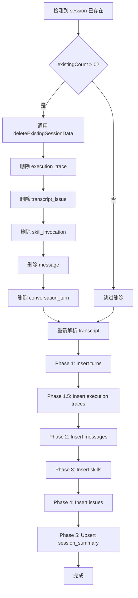

# Session 数据更新机制设计

**日期**: 2026-04-28  
**作者**: AI Assistant  
**状态**: 待实施

---

## 1. 问题背景

### 1.1 当前问题

当重新扫描已存在的 session transcript 文件时，如果文件内容有更新（例如增加了新的 message），现有系统存在以下问题：

1. **Conversation Turn 属性不更新**：
   - `end_message_id`、`end_time` 等字段保持旧值
   - 即使 turn 增加了新的 message，这些属性也不会更新
   
2. **使用 INSERT IGNORE 导致数据不一致**：
   - 所有详细数据表（turns、messages、issues、skills、traces）都使用 `batchInsertIgnore`
   - 如果记录已存在，会跳过插入
   - 无法反映数据的最新状态

3. **设计文档中的未实现功能**：
   - `2026-04-28-scan-statistics-optimization-design.md` 中提到了 `deleteExistingSessionData` 方法
   - 但该方法从未被实现
   - 实际代码中只是记录日志说"will be reprocessed"，但没有执行任何删除操作

### 1.2 影响范围

受影响的数据库表：
- `dashboard_conversation_turn` - 对话轮次
- `dashboard_message` - 消息记录
- `dashboard_skill_invocation` - 技能调用
- `dashboard_transcript_issue` - 问题记录
- `dashboard_execution_trace` - 执行追踪
- `dashboard_session_summary` - 会话汇总（使用 upsert，会自动更新）

---

## 2. 设计目标

### 2.1 核心目标

1. **数据一致性**：重新扫描时，确保所有数据反映 transcript 文件的最新状态
2. **完整性**：turn 的属性（如 `end_message_id`、`end_time`）正确更新
3. **安全性**：在事务中执行删除和重新插入，保证原子性
4. **性能**：避免不必要的操作，优化删除和插入顺序

### 2.2 非目标

- 不改变现有的扫描流程架构
- 不修改数据库 schema
- 不影响其他功能的正常运行

---

## 3. 设计方案

### 3.1 方案概述：删除后重新插入（Delete & Re-insert）

**策略**：
1. 检测到 session 已存在时，先删除该 session 的所有详细数据
2. 然后重新解析并插入最新的数据
3. Session summary 使用 upsert 自动更新，不需要删除

**关键决策**：
- ✅ **删除 5 个详细数据表**：execution_trace, issue, skill, message, turn
- ❌ **不删除 session_summary**：通过 upsert 自动更新统计数据

### 3.2 为什么保留 session_summary？

**原因分析**：

1. **全量扫描**：每次扫描都是全量读取 transcript 文件，`parsed.messages()` 包含所有历史消息
2. **Upsert 逻辑**：session_summary 使用 `ON DUPLICATE KEY UPDATE`，会用新值覆盖旧值
3. **时间戳处理**：
   - Upsert 中有 `LEAST/GREATEST` 保护历史时间范围
   - 但如果从 parsed messages 中提取真实的 min/max 时间戳，结果是一样的
4. **容错性**：即使某次扫描失败，历史统计数据仍然保留

**结论**：删除和不删除 session_summary 的结果几乎相同，但不删除更简单、更安全。

---

## 4. 详细设计

### 4.1 需要添加的 Mapper 方法

#### 4.1.1 ConversationTurnMapper

**接口定义** (`ConversationTurnMapper.java`)：

```java
/**
 * 删除指定 session 的所有对话轮次
 * @param sessionId Session ID
 * @return 删除的记录数
 */
int deleteBySessionId(@Param("sessionId") String sessionId);
```

**XML 实现** (`ConversationTurnMapper.xml`)：

```xml
<!-- Delete conversation turns by session ID -->
<delete id="deleteBySessionId">
    DELETE FROM dashboard_conversation_turn WHERE session_id = #{sessionId}
</delete>
```

#### 4.1.2 TranscriptIssueMapper

**接口定义** (`TranscriptIssueMapper.java`)：

```java
/**
 * 删除指定 session 的所有问题记录
 * @param sessionId Session ID
 * @return 删除的记录数
 */
int deleteBySessionId(@Param("sessionId") String sessionId);
```

**XML 实现** (`TranscriptIssueMapper.xml`)：

```xml
<!-- Delete transcript issues by session ID -->
<delete id="deleteBySessionId">
    DELETE FROM dashboard_transcript_issue WHERE session_id = #{sessionId}
</delete>
```

### 4.2 已存在的删除方法

以下 Mapper 已经有 `deleteBySessionId` 方法，无需修改：
- ✅ `MessageMapper.deleteBySessionId`
- ✅ `SkillInvocationMapper.deleteBySessionId`
- ✅ `ExecutionTraceMapper.deleteBySessionId`
- ✅ `SessionSummaryMapper.deleteBySessionId`（虽然我们不使用）

### 4.3 实现 deleteExistingSessionData 方法

**位置**：`DataIngestionService.java`

**方法签名**：

```java
/**
 * 删除指定 session 的所有相关详细数据
 * 按照依赖关系逆序删除，避免外键约束问题
 * 
 * @param sessionId Session ID
 */
private void deleteExistingSessionData(String sessionId) {
    // 实现见下方
}
```

**实现逻辑**：

```java
private void deleteExistingSessionData(String sessionId) {
    log.info("Deleting existing detail data for session: {}", sessionId);
    
    // 1. 删除执行追踪（依赖 turn_id）
    int traceCount = executionTraceMapper.deleteBySessionId(sessionId);
    log.debug("Deleted {} execution traces", traceCount);
    
    // 2. 删除问题记录（依赖 turn_id）
    int issueCount = issueMapper.deleteBySessionId(sessionId);
    log.debug("Deleted {} transcript issues", issueCount);
    
    // 3. 删除技能调用（依赖 session_id）
    int skillCount = skillMapper.deleteBySessionId(sessionId);
    log.debug("Deleted {} skill invocations", skillCount);
    
    // 4. 删除消息（依赖 turn_id, session_id）
    int messageCount = messageMapper.deleteBySessionId(sessionId);
    log.debug("Deleted {} messages", messageCount);
    
    // 5. 删除对话轮次（核心表，被其他表依赖）
    int turnCount = turnMapper.deleteBySessionId(sessionId);
    log.debug("Deleted {} conversation turns", turnCount);
    
    // ❌ 不删除 session_summary，让 upsert 自动更新
    
    log.info("Successfully deleted detail data for session {}: " +
             "traces={}, issues={}, skills={}, messages={}, turns={}",
             sessionId, traceCount, issueCount, skillCount, 
             messageCount, turnCount);
}
```

**删除顺序说明**：

按照**依赖关系的逆序**删除：
1. 先删除子表（execution_trace, issue, skill, message）- 它们依赖 turn_id
2. 再删除父表（conversation_turn）- 核心表
3. 不删除汇总表（session_summary）- 通过 upsert 更新

虽然没有外键约束，但保持这个顺序是良好的实践。

### 4.4 改进 updateSessionSummary 的时间戳提取

**当前问题**：

第 508-510 行有 TODO 注释：
```java
// Find first and last message timestamps from the messages list
// For now, use current time as approximation
// TODO: Extract actual timestamps from parsed messages
```

当前使用 `now` 作为时间戳，会丢失历史时间范围信息。

**改进方案**：

修改方法签名，接收 `List<MessageRecord>` 参数，从中提取真实的时间戳：

```java
private void updateSessionSummary(Long scanId, String sessionId, String employeeId,
                                  List<MessageRecord> messages, int turnCount, 
                                  int skillCount, int issueCount,
                                  LocalDateTime now) {
    try {
        // ✅ 从解析的消息中提取真实的时间戳范围
        LocalDateTime firstMessageAt = null;
        LocalDateTime lastMessageAt = null;
        
        if (messages != null && !messages.isEmpty()) {
            long minEpochMs = Long.MAX_VALUE;
            long maxEpochMs = Long.MIN_VALUE;
            
            for (MessageRecord msg : messages) {
                if (msg.epochMs() > 0) {
                    minEpochMs = Math.min(minEpochMs, msg.epochMs());
                    maxEpochMs = Math.max(maxEpochMs, msg.epochMs());
                }
            }
            
            if (minEpochMs != Long.MAX_VALUE) {
                firstMessageAt = LocalDateTime.ofInstant(
                    java.time.Instant.ofEpochMilli(minEpochMs), BEIJING_ZONE);
            }
            if (maxEpochMs != Long.MIN_VALUE) {
                lastMessageAt = LocalDateTime.ofInstant(
                    java.time.Instant.ofEpochMilli(maxEpochMs), BEIJING_ZONE);
            }
        }
        
        // 如果没有有效的时间戳，使用当前时间作为后备
        if (firstMessageAt == null) firstMessageAt = now;
        if (lastMessageAt == null) lastMessageAt = now;
        
        DashboardSessionSummary summary = new DashboardSessionSummary();
        summary.setSessionId(sessionId);
        summary.setEmployeeId(employeeId);
        summary.setAgentName("main");
        summary.setTotalMessages(messages != null ? messages.size() : 0);
        summary.setTotalTurns(turnCount);
        summary.setTotalIssues(issueCount);
        summary.setTotalSkills(skillCount);
        summary.setFirstMessageAt(firstMessageAt);   // ✅ 使用真实时间戳
        summary.setLastMessageAt(lastMessageAt);     // ✅ 使用真实时间戳
        summary.setLastScanId(scanId);
        summary.setLastUpdatedAt(now);
        
        sessionSummaryMapper.upsert(summary);
        log.debug("Updated session summary for {} (first: {}, last: {})", 
            sessionId, firstMessageAt, lastMessageAt);
    } catch (Exception e) {
        log.error("Failed to update session summary for {}", sessionId, e);
    }
}
```

### 4.5 在 ingestParsedTranscript 中集成删除逻辑

**修改位置**：`DataIngestionService.ingestParsedTranscript` 方法

**当前代码**（第 89-93 行）：

```java
int existingCount = messageMapper.countBySessionId(sessionId);
if (existingCount > 0) {
    log.info("Session {} already scanned ({} messages), will be reprocessed", 
        sessionId, existingCount);
}
```

**修改为**：

```java
int existingCount = messageMapper.countBySessionId(sessionId);
if (existingCount > 0) {
    log.info("Session {} already scanned ({} messages), deleting old data and reprocessing", 
        sessionId, existingCount);
    // ✅ 删除旧数据，然后重新处理
    deleteExistingSessionData(sessionId);
}
```

**同时修改 updateSessionSummary 调用**（约第 195 行）：

```java
// 当前
updateSessionSummary(scanId, sessionId, employeeId, 
    messages.size(), conversationTurns, skills.size(), issues.size(), now);

// 修改为
updateSessionSummary(scanId, sessionId, employeeId, 
    messages, conversationTurns, skills.size(), issues.size(), now);
```

---

## 5. 数据流图

### 5.1 重新扫描流程



### 5.2 删除顺序

```
依赖关系：
  execution_trace → turn_id
  transcript_issue → turn_id
  skill_invocation → session_id
  message → turn_id, session_id
  conversation_turn ← 被以上表依赖

删除顺序（逆序）：
  1. execution_trace
  2. transcript_issue
  3. skill_invocation
  4. message
  5. conversation_turn
```

---

## 6. 测试计划

### 6.1 单元测试

1. **Mapper 方法测试**：
   - 测试 `ConversationTurnMapper.deleteBySessionId`
   - 测试 `TranscriptIssueMapper.deleteBySessionId`
   - 验证删除后记录数为 0

2. **deleteExistingSessionData 测试**：
   - 创建测试数据（包含所有 5 个表的记录）
   - 调用删除方法
   - 验证所有记录都被删除
   - 验证日志输出正确

3. **时间戳提取测试**：
   - 测试从 messages 中提取 min/max epochMs
   - 测试空列表的边界情况
   - 测试 epochMs 为 0 的情况

### 6.2 集成测试

1. **完整重新扫描流程**：
   - 第一次扫描：插入数据
   - 修改 transcript 文件（增加新的 message）
   - 第二次扫描：触发删除和重新插入
   - 验证 turn 的 `end_message_id` 和 `end_time` 已更新
   - 验证 session_summary 的时间戳正确

2. **事务回滚测试**：
   - 模拟删除后插入失败
   - 验证数据是否回滚到原始状态

### 6.3 性能测试

1. **大数据量测试**：
   - 测试包含大量 message/turn 的 session
   - 测量删除和重新插入的时间
   - 确保在可接受范围内

---

## 7. 风险评估

### 7.1 潜在风险

| 风险 | 影响 | 缓解措施 |
|------|------|---------|
| 删除后插入失败，数据丢失 | 高 | 在 `@Transactional` 中执行，失败时自动回滚 |
| 删除顺序错误导致外键约束违反 | 中 | 严格按照依赖逆序删除 |
| 时间戳提取逻辑错误 | 低 | 添加单元测试，使用当前时间作为后备 |
| 性能下降 | 低 | 删除操作很快，主要开销在解析和插入 |

### 7.2 回滚方案

如果实施后出现问题：

1. **恢复 DataIngestionService**：
   ```bash
   git revert <commit-hash>
   ```

2. **删除新增的 Mapper 方法**：
   - 移除 `ConversationTurnMapper.deleteBySessionId`
   - 移除 `TranscriptIssueMapper.deleteBySessionId`

3. **重新编译和测试**

---

## 8. 实施步骤

### Phase 1: 添加 Mapper 方法（30 分钟）

1. 在 `ConversationTurnMapper.java` 中添加 `deleteBySessionId` 方法
2. 在 `ConversationTurnMapper.xml` 中实现 SQL
3. 在 `TranscriptIssueMapper.java` 中添加 `deleteBySessionId` 方法
4. 在 `TranscriptIssueMapper.xml` 中实现 SQL

### Phase 2: 实现删除逻辑（30 分钟）

1. 在 `DataIngestionService` 中实现 `deleteExistingSessionData` 方法
2. 在 `ingestParsedTranscript` 中调用删除逻辑
3. 修改 `updateSessionSummary` 调用，传递 messages 参数

### Phase 3: 改进时间戳提取（30 分钟）

1. 修改 `updateSessionSummary` 方法签名
2. 实现从 messages 中提取时间戳的逻辑
3. 添加边界情况处理

### Phase 4: 测试与验证（1 小时）

1. 编写单元测试
2. 运行集成测试
3. 手动验证重新扫描场景
4. 检查日志输出

---

## 9. 参考资料

- [2026-04-28-scan-statistics-optimization-design.md](./2026-04-28-scan-statistics-optimization-design.md)
- [2026-04-28-scan-statistics-optimization-plan.md](../plans/2026-04-28-scan-statistics-optimization-plan.md)
- [Session汇总表及增量更新机制](../../memory/project_introduction.md#session汇总表及增量更新机制)

---

## 10. 总结

本设计通过**删除后重新插入**的策略，解决了 session 数据更新的问题：

✅ **解决的问题**：
- Turn 的属性（`end_message_id`、`end_time`）会正确更新
- 所有详细数据反映 transcript 文件的最新状态
- 数据一致性得到保证

✅ **设计优势**：
- 实现简单，逻辑清晰
- 在事务中执行，保证原子性
- 保留 session_summary，利用 upsert 的优势
- 改进时间戳提取，保证历史数据准确性

✅ **实施成本**：
- 只需添加 2 个 Mapper 方法
- 修改 DataIngestionService 中的 3 处代码
- 总工作量约 2-3 小时
